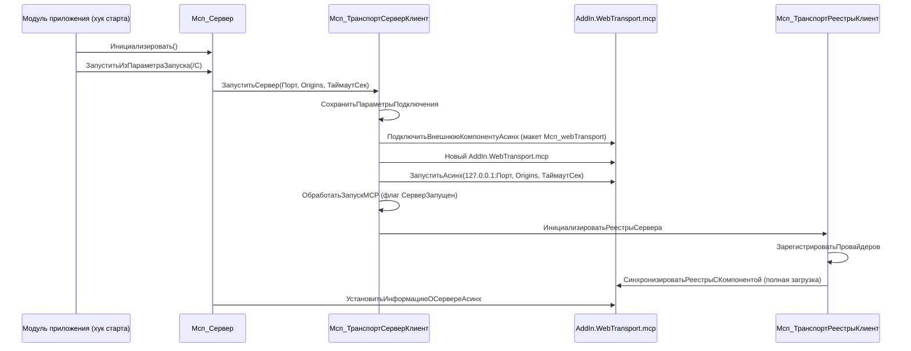
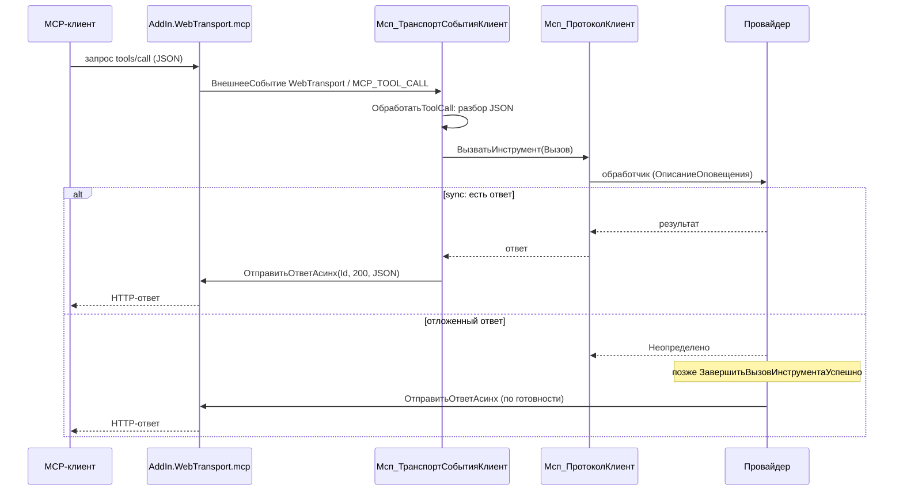

# client-mcp: внутренние механизмы MCP-сервера

Спека разработчика: как расширение `client_mcp` запускает web-сервис MCP внутри клиента 1С и как перенести механизм в другой проект. Про контракт провайдеров — [`client-mcp-providers.md`](client-mcp-providers.md); про стек и структуру исходников — [`stack.md`](stack.md).

Соглашение о координатах: все пути вида `Путь/Файл.bsl:строка` указаны относительно каталога `exts/client-mcp/src/`, если не указан полный путь от корня репозитория. Номера строк соответствуют текущему состоянию исходников и могут смещаться при правках — при расхождении ориентируйтесь на имя метода.

## A. Запуск web-сервиса внутри расширения

### A.1 Обзор

Расширение `client_mcp` встраивает в клиент 1С:Предприятие MCP-сервер (Model Context Protocol). BSL-код не работает с сокетами напрямую: HTTP-сервер живёт во внешней компоненте `AddIn.WebTransport.mcp`, которая поставляется внутри расширения как двоичный макет `CommonTemplates/Мсп_webTransport/Template.addin` и слушает только `127.0.0.1:<порт>`. Компонента принимает MCP-запросы (JSON-RPC поверх HTTP), доставляет их в 1С внешними событиями и получает ответы асинхронными вызовами.

Слои механизма:

| Слой | Модули | Роль |
| --- | --- | --- |
| Фасад API | `Мсп_Сервер` | Публичный контекст провайдеров: конструкторы описаний, регистрация, завершение вызовов |
| Транспорт | `Мсп_ТранспортСерверКлиент`, `Мсп_ТранспортСобытияКлиент`, `Мсп_ТранспортРеестрыКлиент`, `Мсп_ГлобальныеОбработчикиКлиент` | Подключение компоненты, запуск/остановка, входящие события, push-синхронизация реестров |
| Протокол | `Мсп_ПротоколКлиент`, `Мсп_РеестрКлиент`, `Мсп_СостояниеКлиент`, `Мсп_ЗадачиКлиент`, `Мсп_РесурсыКлиент`, `Мсп_СериализацияКлиент` | Разбор/формирование JSON-RPC, реестры в памяти, глобальное состояние, task-режим, чтение ресурсов |
| Провайдеры | `Мсп_МетаданныеСервер`, `Мсп_ПровайдерыКлиент`, `Мсп_ИнструментИнфоИБКлиент` | Обнаружение и регистрация поставщиков инструментов/ресурсов/промптов |
| Утилиты | `Мсп_Коллекции`, `Мсп_Ошибки`, `Мсп_Результаты`, `Мсп_СхемаПараметров`, `Мсп_ЛогированиеКлиент` | Коллекции, фабрики ошибок и результатов, JSON-Schema, логирование |

### A.2 Точки входа расширения

Точка интеграции с клиентом 1С — управляемый модуль приложения расширения (`Configuration/ManagedApplicationModule.bsl`). Расширение не заменяет обработчики целевой конфигурации, а добавляет свои через аннотации `&После`:

- `Configuration/ManagedApplicationModule.bsl:2` — глобальная экспортная переменная `Мсп_Состояние`. Единственное долговременное состояние механизма: через неё транспорт хранит экземпляр компоненты, флаги запуска и реестры. Доступ к переменной — только через `Мсп_СостояниеКлиент` (см. A.4).
- `Configuration/ManagedApplicationModule.bsl:7` — `&После("ОбработкаВнешнегоСобытия")`: после обработчика конфигурации вызывается `Мсп_ТранспортСобытияКлиент.ОбработатьВнешнееСобытие` (`:10`). Это единственный вход входящих MCP-запросов; без хука сервер «глух».
- `Configuration/ManagedApplicationModule.bsl:14` — `&После("ПриНачалеРаботыСистемы")`: вызывает `Мсп_Сервер.Инициализировать()` (`:17`) — создание реестров и регистрация провайдеров, затем `Ждать Мсп_ПараметрыЗапускаКлиент.ЗапуститьИзПараметраЗапуска(ПараметрЗапуска)` (`:18`) — автозапуск сервера, если он заказан в командной строке (см. A.7).

Цель обработчика ожидания — глобальная процедура `Мсп_ГлобальныеОбработчикиКлиент.Мсп_ВыполнитьЗапланированныеСинхронизацииРеестров` (`CommonModules/Мсп_ГлобальныеОбработчикиКлиент/Module.bsl:3`): `ПодключитьОбработчикОжидания` по имени вызывает процедуры глобального контекста, поэтому для целей синхронизации реестров (см. A.5) выделен отдельный модуль с одной процедурой.

### A.3 Подключение внешней компоненты

Компонента поставляется в макете `ОбщийМакет.Мсп_webTransport`. Подключением управляет `Мсп_ТранспортСерверКлиент`:

- `CommonModules/Мсп_ТранспортСерверКлиент/Module.bsl:170` — `ПодключитьКомпоненту`: пытается `ПодключитьВнешнююКомпонентуАсинх` с макетом `ОбщийМакет.Мсп_webTransport` и именем `WebTransport`. Если платформа вернула `Ложь` (компонента ещё не установлена), выполняется `УстановитьВнешнююКомпонентуАсинх` — распаковка из макета, и повторная попытка подключения. При неудаче — исключение с текстом ошибки установки.
- `CommonModules/Мсп_ТранспортСерверКлиент/Module.bsl:208` — `ПодключитьКомпонентуАсинх`: передаёт режим подключения `ТипПодключенияВнешнейКомпоненты.НеИзолированно`, когда этот тип доступен в платформе. Значение типа вычисляется через `Вычислить` — совместимость с версиями платформы, в которых типа ещё нет (fallback: подключение без указания типа).
- Обновление двоичного макета — скриптом `scripts/update-web-transport.sh` (апстрим компоненты — `alkoleft/web-transport-addin`, asset `WebTransportAddIn.zip`).

### A.4 Жизненный цикл сервера

Запуск (из формы, `/C` или кодом) сходится к `Мсп_Сервер.Запустить` (`CommonModules/Мсп_Сервер/Module.bsl:147`):

1. `Мсп_ТранспортСерверКлиент.ЗапуститьСервер(Порт, Origins, ТаймаутСек)` (`CommonModules/Мсп_ТранспортСерверКлиент/Module.bsl:12`):
   - `СохранитьПараметрыПодключения` (`:13`, реализация — `:164`) — параметры сохраняются в `Мсп_Состояние` до попытки подключения;
   - `ПодключитьКомпоненту` (`:20`) — см. A.3;
   - если компонента уже была запущена — остановка предыдущего экземпляра (`:22`–`:27`);
   - создание экземпляра: `Компонента = Новый("AddIn.WebTransport.mcp")` (`:30`), сохранение в состояние;
   - `ЗапуститьКомпоненту` (`:238`) — `Компонента.ЗапуститьАсинх(АдресПрослушивания, Origins, ТаймаутСек)`; адрес формируется как `"127.0.0.1:" + Порт` (`:253`);
   - `ОбработатьЗапускMCP` (`:258`) — установка флага `СерверЗапущен`;
   - `ИнициализироватьРеестрыСервера` — полная начальная синхронизация реестров (см. A.5).
2. `УстановитьИнформациюОСервере` (`CommonModules/Мсп_Сервер/Module.bsl:156` → `CommonModules/Мсп_ТранспортСерверКлиент/Module.bsl:116`) — публикация имени/версии сервера в компоненте (`УстановитьИнформациюОСервереАсинх`).

Параметры по умолчанию задаёт `Мсп_Сервер.НовыйПараметрыСервера` (`CommonModules/Мсп_Сервер/Module.bsl:124`): `Origins = "*"`, `ТаймаутСек = 900`.

Остановка: `Мсп_Сервер.Остановить` (`CommonModules/Мсп_Сервер/Module.bsl:164`) → `ОстановитьСервер` (`CommonModules/Мсп_ТранспортСерверКлиент/Module.bsl:45`) → `ОстановитьКомпоненту` (`:228`, `Компонента.ОстановитьАсинх`) → `ОбработатьОстановкуMCP` (`:277`) — сброс флагов и экземпляра в состоянии.

Состояние сервера — структура в глобальной переменной `Мсп_Состояние` (см. A.2), доступ и ленивая инициализация — `Мсп_СостояниеКлиент.СостояниеСервера` (`CommonModules/Мсп_СостояниеКлиент/Module.bsl:7`, шаблон состояния `НовыйСостояние` — `:44`: `Реестры`, `ПараметрыЛогирования`). Ключи состояния: `Компонента` (экземпляр, `ЭкземплярСервера` — `CommonModules/Мсп_ТранспортСерверКлиент/Module.bsl:59`), `СерверЗапущен` (`:67`), `Реестры`, флаги синхронизации. Читатели: `ПолучитьПортСервера` (`:77`), `ПолучитьАдресПрослушивания` (`:85`).

Инициализация реестров и регистрация провайдеров при старте — `Мсп_Сервер.Инициализировать` (`CommonModules/Мсп_Сервер/Module.bsl:5`).

### A.5 Push-синхронизация реестров в компоненту

Источник истины — реестры в памяти 1С (`Мсп_РеестрКлиент.ИнициализироватьРеестры` — `CommonModules/Мсп_РеестрКлиент/Module.bsl:4`: соответствия `Инструменты` по имени, `Ресурсы` по URI, `ШаблоныРесурсов` по шаблону URI, `Промпты` по имени; доступ — `ПолучитьРеестр`, `:389`). Компонента — зеркало: её инструментарий перезаливается целиком при каждом изменении.

Цикл изменения:

1. Провайдер вызывает `Мсп_Сервер.ЗарегистрироватьИнструмент` (`CommonModules/Мсп_Сервер/Module.bsl:185`; аналогично ресурсы/шаблоны/промпты) — запись в реестр + планирование синхронизации.
2. `Мсп_ТранспортРеестрыКлиент.ЗапланироватьСинхронизациюИнструментов/Ресурсов/Промптов/Реестров` (`CommonModules/Мсп_ТранспортРеестрыКлиент/Module.bsl:4`, `:11`, `:18`, `:25`) → `ЗапланироватьСинхронизацию` (`:321`): guard-проверки (сервер не запущен — `Ложь`; идут `ИнициализацияРеестровСервера` или `РегистрацияПровайдераВыполняется` — `Ложь`), установка флага `ТребуетсяСинхронизация*`.
3. `ЗапланироватьОбработчикСинхронизации` (`:334`): если проход не выполняется и обработчик ещё не запланирован — `ПодключитьОбработчикОжидания("Мсп_ВыполнитьЗапланированныеСинхронизацииРеестров", 1, Истина)`. Интервал 1 секунда, одноразовый — это дебаунс: серии регистраций за секунду схлопываются в один проход.
4. `Мсп_ГлобальныеОбработчикиКлиент.Мсп_ВыполнитьЗапланированныеСинхронизацииРеестров` (`CommonModules/Мсп_ГлобальныеОбработчикиКлиент/Module.bsl:3`) → `ВыполнитьЗапланированныеСинхронизации` (`CommonModules/Мсп_ТранспортРеестрыКлиент/Module.bsl:277`): цикл проходов, пока взведены флаги (за время прохода могли появиться новые изменения); каждый проход — `ВыполнитьЗапланированныйПроходСинхронизации` (`:305`).
5. Полная перезаливка: `СинхронизироватьИнструменты` (`:95`) — `ОчиститьИнструментыАсинх`, затем для каждого включённого инструмента `ЗарегистрироватьИнструментАсинх` с JSON-описанием, сформированным `Мсп_ПротоколКлиент.НовыйОписаниеИнструмента` (`CommonModules/Мсп_ПротоколКлиент/Module.bsl:216`; task-режим передаётся отдельным параметром); аналогично `СинхронизироватьРесурсы` (`:141`, ресурсы + шаблоны) и `СинхронизироватьПромпты` (`:192`).
6. Уведомление подключённых MCP-клиентов: `УведомитьОбИзмененииИнструментов/Ресурсов/Промптов` (`:35`, `:55`, `:75`) — компонента рассылает server-notification `tools/list_changed` / `resources/list_changed` / `prompts/list_changed`. Обновление одного ресурса без смены реестра — `УведомитьОбОбновленииРесурса` (`:229`).

Начальная синхронизация при старте — `ИнициализироватьРеестрыСервера` (`:246`): если реестры ещё пусты, создаёт их, поднимает флаг `ИнициализацияРеестровСервера` (чтобы регистрации провайдеров в этот момент не планировали лишние проходы), регистрирует провайдеров и выполняет `СинхронизироватьРеестрыСКомпонентой` (`:263`).

### A.6 Обработка входящих событий

Компонента генерирует `ВнешнееСобытие` с `Источник = "WebTransport"`. `Мсп_ТранспортСобытияКлиент.ОбработатьВнешнееСобытие` (`CommonModules/Мсп_ТранспортСобытияКлиент/Module.bsl:12`) фильтрует по источнику (`:13`) и диспетчеризует по типу события:

| Событие | Строка | Обработчик |
| --- | --- | --- |
| `MCP_TOOL_CALL` | `:27` | `ОбработатьToolCall` (`:212`) |
| `MCP_RESOURCE_READ` | `:32` | `ОбработатьResourceRead` (`:262`) |
| `MCP_PROMPT_GET` | `:37` | `ОбработатьPromptGet` (`:285`) |
| `MCP_NOTIFICATION` | `:42` | `ОбработатьNotification` (`:308`, логирование) |
| `MCP_RESOURCE_SUBSCRIBE` | `:47` | `ОбработатьResourceSubscribe` (`:342`, логирование URI) |
| `MCP_RESOURCE_UNSUBSCRIBE` | `:52` | `ОбработатьResourceUnsubscribe` (`:352`, логирование URI) |
| `MCP_TASK_CANCELLED` | `:57` | `Мсп_ЗадачиКлиент.ОбработатьTaskCancelled` (`CommonModules/Мсп_ЗадачиКлиент/Module.bsl:142`) |

Вызов инструмента (`ОбработатьToolCall`, `:212`): JSON-тело разбирается в вызов (`НовыйВызовИнструментаИзЗапроса`, `:83`) — `executionMode` (`sync` по умолчанию, `task` требует `taskId`, `sync` требует `id`), `_meta.progressToken` (`:167`). Далее `Мсп_ПротоколКлиент.ВызватьИнструмент` (`CommonModules/Мсп_ПротоколКлиент/Module.bsl:19`) валидирует вызов и запускает обработчик провайдера. Режимы результата:

- **sync** — обработчик вернул результат: ответ отправляется сразу `ОтправитьОтвет` (`CommonModules/Мсп_ТранспортСобытияКлиент/Module.bsl:320`);
- **отложенный (deferred)** — обработчик вернул `Неопределено`: транспорт не отвечает, провайдер позже вызывает `Мсп_Сервер.ЗавершитьВызовИнструментаУспешно` / `ЗавершитьВызовИнструментаСОшибкой` (`CommonModules/Мсп_Сервер/Module.bsl:285`, `:300`), которые и отправляют ответ;
- **task** — ответ уходит через `Мсп_ЗадачиКлиент.ЗавершитьЗадачуПоОтветуИнструмента` (`CommonModules/Мсп_ЗадачиКлиент/Module.bsl:49`); отмена — `MCP_TASK_CANCELLED` помечает `taskId` в `ОтмененныеЗадачи`, длительные операции опрашивают `Мсп_Сервер.ЗадачаОтменена` (`CommonModules/Мсп_Сервер/Module.bsl:367`); завершение задачи — `ЗавершитьЗадачу` (`CommonModules/Мсп_ЗадачиКлиент/Module.bsl:166`): установка статуса, отправка JSON-ответа, очистка отметки отмены.

Отправка ответа: `ОтправитьОтвет` (`CommonModules/Мсп_ТранспортСобытияКлиент/Module.bsl:320`) сериализует данные и вызывает `Компонента.ОтправитьОтветАсинх(Id, 200, "application/json; charset=utf-8", ОтветJSON)`.

### A.7 Способы запуска

**Через командную строку.** `Мсп_ПараметрыЗапускаКлиент.ЗапуститьИзПараметраЗапуска` (`CommonModules/Мсп_ПараметрыЗапускаКлиент/Module.bsl:7`, вызывается из хука старта — A.2) читает параметр запуска `/C`:

- формат параметра — `;`-разделённые пары `key=value`, ключи регистронезависимы (`РазобратьПараметрЗапуска`, `:54`);
- `runMcp=<путь>` — путь к JSON-файлу `{ "port": <число>, "timeout": <секунды> }` (`ПрочитатьПараметрыJSON`, `:81`, чтение в UTF-8; отсутствие/битый JSON — исключение);
- дефолты: порт `8080`, таймаут `900` (`ПодготовитьПараметрыСервера`, `:24`, значения по умолчанию — `:31`–`:32`);
- ключ `mcpPort` командной строки приоритетнее значения `port` из JSON (`:43`);
- ключи логирования: `log`, `logLevel`, `logFile` (`Мсп_ЛогированиеКлиент.ПрименитьПараметрыЗапуска`, `CommonModules/Мсп_ЛогированиеКлиент/Module.bsl:69`).

Пример: `1cv8c.exe /URI <база> /C "runMcp=C:\mcp\run.json;mcpPort=8181"`.

**Через форму.** Общая форма `Мсп_УправлениеMCP`: поля порт/Origins/таймаут; `Запустить` (`CommonForms/Мсп_УправлениеMCP/Module.bsl:118`) → `Мсп_Сервер.ЗапуститьСервер(Порт, РазрешенныеOrigins, ТаймаутСек)` (`:129`); `Остановить` (`:139`) → `Мсп_Сервер.Остановить()` (`:140`). Там же — переключатели включённости каждого инструмента/ресурса/промпта (`:62`–`:116`) и настройки логирования (`:4`–`:32`). Решение о автозапуске через `/C` зафиксировано в [ADR-0002](../decisions/0002-command-line-mcp-server-startup.md).

### A.8 Диаграммы последовательности

Запуск сервера:

Вызов инструмента:

## C. Чек-лист переноса в другой проект

Механизм переносится как расширение целиком; ниже — вердикт по каждому элементу. «Как есть» — копировать без правок; «адаптировать» — копировать с изменениями под целевой проект; «опционально» — можно не переносить.

### C.1 Таблица модулей

| Элемент | Роль | Вердикт |
| --- | --- | --- |
| `Configuration/ManagedApplicationModule.bsl` | Глобальная `Мсп_Состояние` + хуки `&После` старта и внешнего события | Адаптировать: перенести хуки и переменную в модуль приложения целевого проекта (или его расширения); проверить, что имя `Мсп_Состояние` свободно |
| `CommonModules/Мсп_Сервер` | Фасад публичного API | Как есть |
| `CommonModules/Мсп_ТранспортСерверКлиент` | Подключение компоненты, запуск/остановка | Как есть |
| `CommonModules/Мсп_ТранспортСобытияКлиент` | Диспетчер входящих событий | Как есть |
| `CommonModules/Мсп_ТранспортРеестрыКлиент` | Push-синхронизация реестров | Как есть |
| `CommonModules/Мсп_ГлобальныеОбработчикиКлиент` | Цель `ПодключитьОбработчикОжидания` | Как есть |
| `CommonModules/Мсп_ПараметрыЗапускаКлиент` | Разбор `/C runMcp` | Как есть (опционально убрать, если запуск только программный) |
| `CommonModules/Мсп_МетаданныеСервер` | Обнаружение провайдеров по метаданным | Как есть |
| `CommonModules/Мсп_ПровайдерыКлиент` | Вызов `Зарегистрировать` у провайдеров | Как есть |
| `CommonModules/Мсп_РеестрКлиент` | Реестры в памяти, валидация описаний | Как есть |
| `CommonModules/Мсп_СостояниеКлиент` | Доступ к `Мсп_Состояние` | Как есть |
| `CommonModules/Мсп_ПротоколКлиент` | Вызовы/ответы/контексты JSON-RPC | Как есть |
| `CommonModules/Мсп_ЗадачиКлиент` | Task-режим и отмена | Как есть (опционально, если task-инструменты не нужны) |
| `CommonModules/Мсп_РесурсыКлиент` | Помощники чтения ресурсов (`РезультатРесурса` — `Module.bsl:12`) | Как есть (опционально, если ресурсы не нужны) |
| `CommonModules/Мсп_ЛогированиеКлиент` | Логирование | Как есть |
| `CommonModules/Мсп_СериализацияКлиент` | Прочитать/сериализовать JSON | Как есть |
| `CommonModules/Мсп_Коллекции` | Доступ к свойствам структур/соответствий | Как есть |
| `CommonModules/Мсп_Ошибки` | Фабрики ошибок MCP | Как есть |
| `CommonModules/Мсп_Результаты` | Упаковка результатов | Как есть |
| `CommonModules/Мсп_СхемаПараметров` | Хелперы JSON-Schema | Как есть |
| `CommonModules/Мсп_ИнструментИнфоИБКлиент` | Встроенный провайдер `infobase_info` | Опционально: образец контракта; можно заменить своим |
| `CommonForms/Мсп_УправлениеMCP` | Ручное управление и диагностика | Опционально: не нужна при запуске только через `/C` |
| `CommonTemplates/Мсп_webTransport` | Двоичный макет компоненты | Адаптировать: переносится как есть; обновление — своим скриптом по образцу `scripts/update-web-transport.sh` |
| `Subsystems/Мсп_MCP` | Группировка объектов в командном интерфейсе | Адаптировать: состав под целевой проект (кодом не используется) |
| `Subsystems/Мсп_Провайдеры` | Точка обнаружения провайдеров | Адаптировать: должна существовать, состав — провайдеры целевого проекта |

### C.2 Обязательные элементы

- Префикс `Мсп_` у всех объектов расширения — код ссылается на модули по именам; при переименовании префикса нужна сквозная замена.
- Глобальная переменная `Мсп_Состояние Экспорт` в модуле приложения и доступ к ней только через `Мсп_СостояниеКлиент`.
- Хук `&После("ОбработкаВнешнегоСобытия")` → `Мсп_ТранспортСобытияКлиент.ОбработатьВнешнееСобытие` — без него входящие запросы не доставляются.
- Хук `&После("ПриНачалеРаботыСистемы")` → `Мсп_Сервер.Инициализировать` + запуск из `/C` — только если нужен автозапуск.
- Макет `Мсп_webTransport` с актуальным `Template.addin`.
- Подсистема `Мсп_Провайдеры` — реестр провайдеров; паттерн суффикса `*_Мсп_Провайдеры` позволяет соседним подсистемам целевой конфигурации поставлять своих провайдеров (правила обнаружения — в [`client-mcp-providers.md`](client-mcp-providers.md), раздел B.1).

### C.3 Порядок внедрения

1. Скопировать инфраструктурные общие модули (все «Как есть» из таблицы C.1) без изменений.
2. Добавить макет `Мсп_webTransport` с `Template.addin`; наладить обновление компоненты скриптом.
3. Создать подсистемы `Мсп_MCP` и `Мсп_Провайдеры`.
4. Встроить в модуль приложения: переменную `Мсп_Состояние` и хуки `&После` (порядок вызовов — A.2).
5. Проверить запуск: `Мсп_Сервер.Запустить` (или форма/`/C`) — сервер слушает `127.0.0.1:<порт>`, реестры синхронизированы.
6. Зарегистрировать первого провайдера: скопировать `Мсп_ИнструментИнфоИБКлиент` как образец или написать свой по [`client-mcp-providers.md`](client-mcp-providers.md); проверить `tools/list`.
7. Подключить форму `Мсп_УправлениеMCP` (если нужна ручная диагностика) и логирование.
8. Прогнать протоколные проверки: `tools/list`, `tools/call`, отложенный вызов; при использовании task-режима — отмену задачи.

### C.4 Чем заменяется компонента

Если `WebTransport` недоступен (другая платформа, политика безопасности), заменяется любая внешняя компонента Native API, реализующая наблюдаемый контракт (восстановлен по вызовам из BSL-кода):

- подключение из макета; программный идентификатор `AddIn.WebTransport.mcp`;
- HTTP-сервер только на `127.0.0.1:<порт>` с настройками Origins и таймаутом;
- асинхронные методы: `ЗапуститьАсинх(Адрес, Origins, ТаймаутСек)`, `ОстановитьАсинх()`, `ОтправитьОтветАсинх(Id, Код, Заголовки, Тело)`, `УстановитьИнформациюОСервереАсинх(...)`, реестровые `ОчиститьИнструментыАсинх` / `ЗарегистрироватьИнструментАсинх` (и аналоги для ресурсов и промптов), `УведомитьОбИзменении…Асинх`, методы статуса и завершения задач, уведомление о прогрессе;
- доставка входящих запросов через `ВнешнееСобытие` с `Источник = "WebTransport"` и кодами событий `MCP_TOOL_CALL` / `MCP_RESOURCE_READ` / `MCP_PROMPT_GET` / `MCP_NOTIFICATION` / `MCP_RESOURCE_SUBSCRIBE` / `MCP_RESOURCE_UNSUBSCRIBE` / `MCP_TASK_CANCELLED`; тело запроса — JSON.

Апстрим текущей компоненты: `alkoleft/web-transport-addin` (asset `WebTransportAddIn.zip`).
